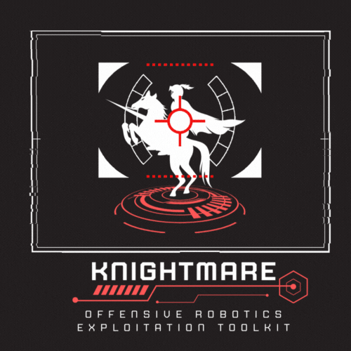
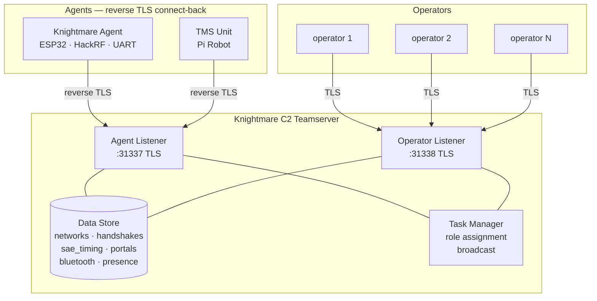
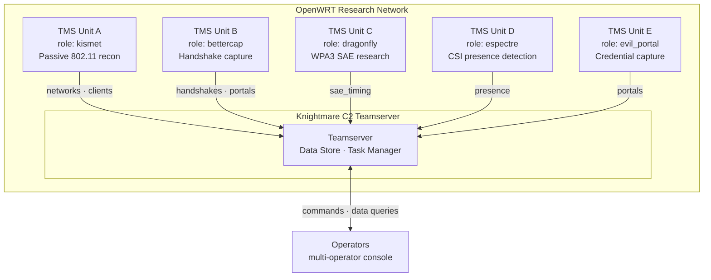
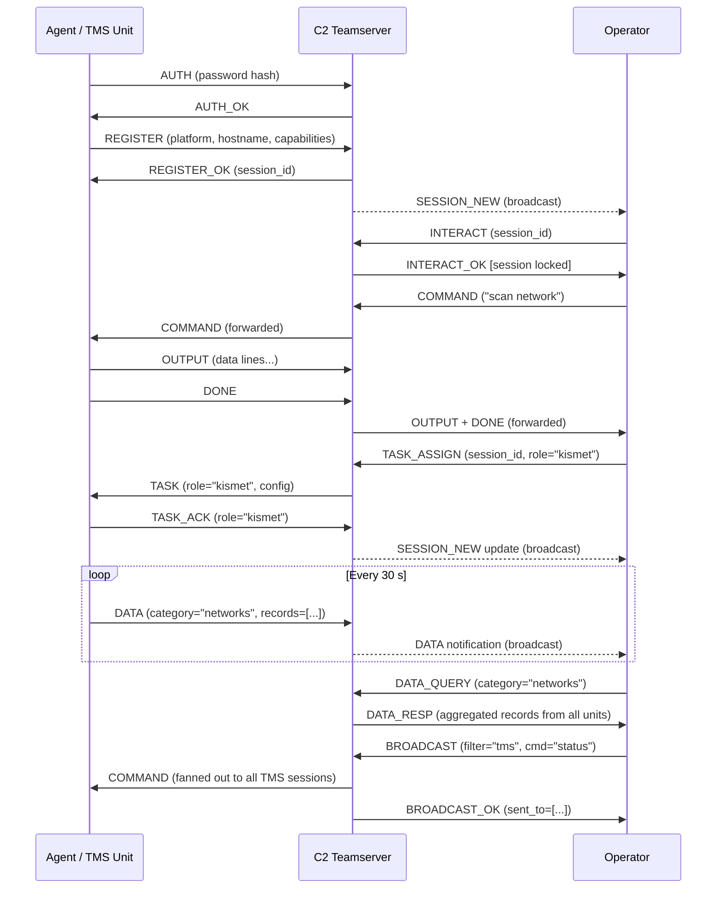
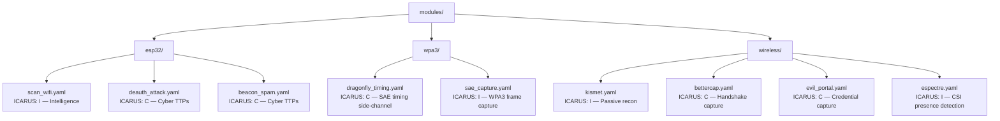
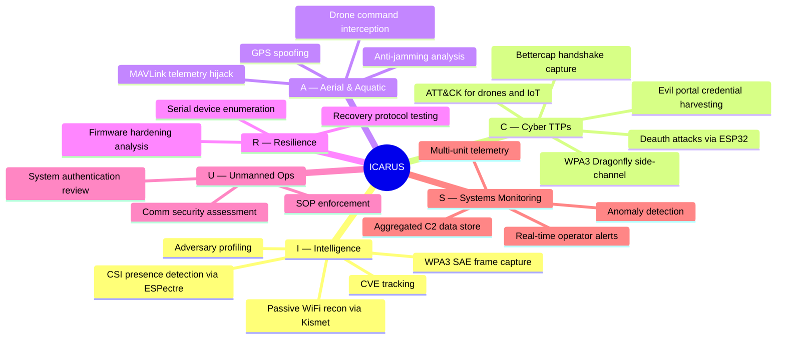

# Knightmare
## Autonomous Robotics & IoT Exploitation Framework

<p align="center">
  
</p>

**Knightmare** is a modular, multi-operator C2 framework for offensive operations against drones, robots, IoT, and RF systems. Inspired by [Sliver](https://github.com/BishopFox/sliver) and [Ligolo-ng](https://github.com/nicocha30/ligolo-ng), it combines a reverse-connect agent architecture with a Metasploit-style CLI and YAML-driven exploit modules.

Designed to operate alongside [Tengu Marauder Stryker (TMS)](https://github.com/Lexicon121/Tengu-Marauder-Stryker) — a mobile cyber-physical research platform — Knightmare acts as the C2 backbone, enabling operators to control TMS units and standalone Knightmare agents from a single console.

---

## Architecture



- **Agents** initiate reverse TLS connections to the C2 server — no inbound firewall rules needed on the agent side.
- **Operators** connect to the C2 server from anywhere and share a live session list.
- **Session locking** — one operator interacts with an agent at a time; others observe.
- **TLS** — self-signed certificate auto-generated on first server start. Distribute `c2/certs/server.crt` to agents and operators.

---

## Multi-Unit Mesh Operation

A typical deployment with 5 TMS units on a shared OpenWRT research network, each assigned a different role:



Operators query the aggregated data store across all units simultaneously:

```
knightmare> data summary          # counts from all 5 units
knightmare> data networks         # all SSIDs seen across the mesh
knightmare> data sae_timing       # Dragonfly timing from unit C
knightmare> data presence         # motion events from unit D
```

---

## Features

- Reverse-connect agent model (Ligolo-ng style) — agents call back, bypassing NAT
- Multi-operator support with shared session state (Sliver style)
- Session locking — prevents conflicting commands to physical hardware
- Metasploit-style CLI for local and remote operations
- YAML-driven exploit modules with ICARUS pillar alignment
- Serial/UART device detection and communication (ESP32, Arduino, etc.)
- MAVLink support for drone command & control
- TLS-encrypted operator and agent channels
- Persistent activity logging
- Integration with Tengu Marauder Stryker (TMS)

---

## Message Protocol Flow

How an agent connects, gets tasked, and streams data back to operators:



---

## Components

| Component | File | Description |
|-----------|------|-------------|
| C2 Server | `c2/server.py` | Central broker — manages agents and operators |
| C2 Agent (Knightmare) | `c2/agent.py` | Wraps Knightmare capabilities, connects to C2 |
| C2 Agent (TMS) | *(in TMS repo)* `Control/services/c2_agent.py` | Routes C2 commands to TMS hardware services |
| Operator Console | `c2/operator.py` | Interactive multi-operator CLI |
| Protocol | `c2/protocol.py` | Shared JSON-over-TLS message protocol |
| Local CLI | `knightmare.py` | Standalone Metasploit-style local CLI |
| Controller | `core/knightmare_controller.py` | Serial, module, and payload management |
| Modules | `modules/` | YAML exploit modules |
| Payloads | `payloads/` | Python payload scripts |

---

## Quick Start

### 1. Install dependencies

```bash
pip install -r requirements.txt
```

### 2. Start the C2 server

```bash
python -m c2.server --password <shared-password>
```

First run generates a self-signed TLS certificate at `c2/certs/server.crt`.
Copy this file to every agent and operator machine.

### 3. Connect operators

```bash
python -m c2.operator \
  --host <server-ip> \
  --password <shared-password> \
  --name alice \
  --cert c2/certs/server.crt
```

### 4. Deploy a Knightmare agent

On the target host (with ESP32, HackRF, or other attached hardware):

```bash
python -m c2.agent \
  --host <server-ip> \
  --password <shared-password> \
  --cert c2/certs/server.crt
```

### 5. Deploy a TMS agent

On the Tengu Marauder Stryker Raspberry Pi, add to `operatorcontrol.py`:

```python
from Control.services.c2_agent import C2AgentService
from Control.services import status

c2 = C2AgentService(
    drive_svc    = drive,
    marauder_svc = marauder,
    scanner_svc  = scanner,
    status_fn    = status.get_status,
)
c2.start(host="<server-ip>", password="<shared-password>", cert="server.crt")
```

---

## Operator Console Reference

```
knightmare> sessions
ID         PLATFORM       HOSTNAME               USER           CONNECTED              LOCKED BY
─────────────────────────────────────────────────────────────────────────────────────
A1B2C3D4   knightmare     kali-workstation       root           2025-01-01 12:00:00   —
E5F6G7H8   tms            pi4-tms                pi             2025-01-01 12:01:00   —

knightmare> interact E5F6G7H8
[*] Interacting with session E5F6G7H8 (tms@pi4-tms)

[tms:pi4-tms]> status
CPU    : 14%
RAM    : 412 / 3900 MB  (10%)
Motors : online
Marauder: connected

[tms:pi4-tms]> drive forward
Moving forward.

[tms:pi4-tms]> marauder scanap
[*] Command sent.

[tms:pi4-tms]> background
[*] Session E5F6G7H8 backgrounded.

knightmare> interact A1B2C3D4
[*] Interacting with session A1B2C3D4 (knightmare@kali-workstation)

[knightmare:kali-workstation]> list
  esp32/beacon_spam                   [C]  Flood area with fake SSIDs
  esp32/deauth_attack                 [C]  IEEE 802.11 deauthentication attack
  esp32/scan_wifi                     [I]  Passive WiFi AP and client scanner

[knightmare:kali-workstation]> use esp32/deauth_attack
[knightmare:kali-workstation]> show options
target_bssid =
channel = 1

[knightmare:kali-workstation]> set target_bssid AA:BB:CC:DD:EE:FF
[knightmare:kali-workstation]> connect /dev/ttyUSB0
[knightmare:kali-workstation]> run deauth
```

### Knightmare session commands

| Command | Description |
|---------|-------------|
| `list` | List available exploit modules |
| `use <module>` | Load a module (e.g. `esp32/deauth_attack`) |
| `info` | Show loaded module details |
| `show options\|payloads` | Show options or available payloads |
| `set <option> <value>` | Set a module option |
| `connect <device>` | Connect to a serial device |
| `devices` | List detected serial/USB devices |
| `run <payload>` | Execute a payload over serial |
| `icarus <I\|C\|A\|R\|U\|S>` | ICARUS pillar reference |

### TMS session commands

| Command | Description |
|---------|-------------|
| `drive forward\|back\|left\|right\|stop` | Motor control |
| `marauder <command>` | Send ESP32 Marauder command |
| `scan network\|wifi\|bluetooth\|rf` | Start a recon scan |
| `portscan <target> [flags]` | Nmap port scan |
| `ping <host>` | ICMP ping |
| `dns <host>` | DNS lookup |
| `interfaces` | List wireless interfaces |
| `status` | System telemetry (CPU/RAM/disk/GPS) |

---

## Local CLI (standalone, no C2)

```bash
python knightmare.py
```

```
knightmare> use esp32/scan_wifi
knightmare> connect /dev/ttyUSB0
knightmare> run scan_wifi
knightmare> log show
```

---

## Module Hierarchy



---

## Directory Structure

```
Knightmare/
├── c2/
│   ├── __init__.py
│   ├── protocol.py       # Shared message protocol
│   ├── server.py         # C2 server (asyncio, TLS)
│   ├── agent.py          # Knightmare reverse agent
│   ├── operator.py       # Multi-operator CLI
│   └── certs/
│       ├── server.crt    # Auto-generated TLS cert (distribute to agents/operators)
│       └── server.key    # Private key (keep on server only)
├── core/
│   ├── knightmare_controller.py
│   ├── exploit_loader.py
│   └── payload_manager.py
├── modules/
│   ├── esp32/
│   │   ├── scan_wifi.yaml
│   │   ├── deauth_attack.yaml
│   │   └── beacon_spam.yaml
│   ├── wpa3/
│   │   ├── dragonfly_timing.yaml
│   │   └── sae_capture.yaml
│   └── wireless/
│       ├── kismet.yaml
│       ├── bettercap.yaml
│       ├── evil_portal.yaml
│       └── espectre.yaml
├── payloads/
│   └── reverse_shell.py
├── logs/
│   └── knightmare.log
├── knightmare.py         # Standalone local CLI
└── requirements.txt
```

---

## ICARUS Framework

Knightmare modules are aligned to the ICARUS offensive framework pillars:



---

## Related Projects

- **[Tengu Marauder Stryker](https://github.com/Lexicon121/Tengu-Marauder-Stryker)** — Mobile cyber-physical research platform (Raspberry Pi robot with ESP32 Marauder, SDR, and WiFi capabilities). Deploy the TMS C2 agent to bring it under Knightmare C2.

---

## Credits & Acknowledgements

**Built by** Lexie Thach ([@Lexicon121](https://github.com/Lexicon121))

---

### C2 / Framework Inspiration

| Project | Author | Description |
|---------|--------|-------------|
| [Sliver](https://github.com/BishopFox/sliver) | [BishopFox](https://github.com/bishopfox) | Multi-operator C2 framework — inspired Knightmare's teamserver architecture and operator model |
| [Ligolo-ng](https://github.com/nicocha30/ligolo-ng) | [nicocha30](https://github.com/nicocha30) | Reverse tunnel agent model — inspired Knightmare's reverse-connect TLS agent design |
| [Metasploit Framework](https://github.com/rapid7/metasploit-framework) | [Rapid7](https://github.com/rapid7) | Inspired the local CLI structure, module system, and YAML exploit format |
| [MITRE ATT&CK](https://attack.mitre.org/) | MITRE | Adversarial TTP taxonomy used for ICARUS pillar alignment |

---

### Hardware & Firmware

| Project | Author | Description |
|---------|--------|-------------|
| [ESP32 Marauder](https://github.com/justcallmekoko/ESP32Marauder) | [justcallmekoko](https://github.com/justcallmekoko) | ESP32 WiFi/Bluetooth offensive toolkit — serial backend for esp32 modules and evil portal |
| [ESPectre](https://github.com/francescopace/espectre) | [francescopace](https://github.com/francescopace) | WiFi CSI-based motion and presence detection using ESP32 — powers the `espectre` role |
| [pymavlink](https://github.com/ArduPilot/pymavlink) | [ArduPilot](https://github.com/ArduPilot) | MAVLink protocol implementation — drone C2 and telemetry support |

---

### WPA3 / Dragonfly Research

| Project | Author | Description |
|---------|--------|-------------|
| [Dragonblood](https://github.com/vanhoefm/dragonblood) | [Mathy Vanhoef](https://github.com/vanhoefm) | WPA3 SAE (Dragonfly) side-channel and denial-of-service research — dragonslayer, dragondrain tooling |
| [wpa3.mathyvanhoef.com](https://wpa3.mathyvanhoef.com/) | Mathy Vanhoef | WPA3 Dragonfly vulnerability disclosure and research reference |
| [hcxdumptool](https://github.com/ZerBea/hcxdumptool) | [ZerBea](https://github.com/ZerBea) | Active packet capture tool for WPA/WPA2/WPA3 frame collection |
| [hcxtools](https://github.com/ZerBea/hcxtools) | [ZerBea](https://github.com/ZerBea) | Conversion and analysis tools for pcapng captures including SAE frames |

---

### Wireless / Network Tools

| Project | Author | Description |
|---------|--------|-------------|
| [Kismet](https://github.com/kismetwireless/kismet) | [dragorn](https://github.com/dragorn) | Passive 802.11 / Bluetooth / RF monitoring — powers the `kismet` role and network data streaming |
| [Bettercap](https://github.com/bettercap/bettercap) | [evilsocket](https://github.com/evilsocket) | Network attack and monitoring framework — WPA handshake capture and HTTP credential monitoring |
| [Aircrack-ng](https://github.com/aircrack-ng/aircrack-ng) | [Aircrack-ng team](https://github.com/aircrack-ng) | 802.11 WEP/WPA/WPA2 cracking suite — used for monitor mode and packet injection |

---

### Python Libraries

| Library | Repo | Description |
|---------|------|-------------|
| [cryptography](https://github.com/pyca/cryptography) | [PyCA](https://github.com/pyca) | TLS certificate generation for C2 server |
| [pyserial](https://github.com/pyserial/pyserial) | [pyserial](https://github.com/pyserial/pyserial) | Serial/UART communication with ESP32, Arduino, and other hardware |
| [PyYAML](https://github.com/yaml/pyyaml) | [YAML](https://github.com/yaml) | Module configuration parsing |
| [pymavlink](https://github.com/ArduPilot/pymavlink) | [ArduPilot](https://github.com/ArduPilot) | MAVLink protocol for drone command and control |

---

## Disclaimer

For educational purposes and authorized security testing only. Only use against systems you own or have explicit written permission to test. All referenced tools and frameworks are the property of their respective authors — see individual project licenses before use.
